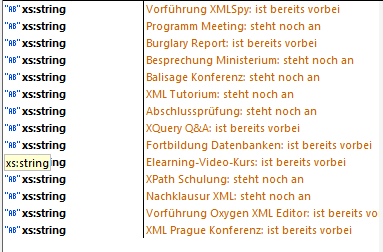

= Übung 03
:author: Florian Weingartshofer
:email: <S1910307103@students.fh-hagenberg.at>
:reproducible:
:listing-caption: Listing
:source-highlighter: rouge
:stem:
:toc:

== XPath Basics
*Achtung bei manchen Screenshots sind die gematchten Elemente fett geschrieben.*

.1.1
[source,xpath]
----
//@*
----

.1.1

.1.2
[source,xpath]
----
//recordlist/*/*
----

.1.2

.1.3
[source,xpath]
----
//band[position() = last() - 1]
----

.1.3

.1.4
[source,xpath]
----
count(//recordlist//*)
----

.1.4

.1.5
[source,xpath]
----
//title[string-length(text()) >= 14]
----

.1.5

.1.6
[source,xpath]
----
count(//record[number(@year) >= 2000])
----

.1.6

.1.7
[source,xpath]
----
//*[@band = "lgaga" and @year > 2009]/title
----

.1.7

.1.8
[source,xpath]
----
//title[text() = "Radetzkymarsch"]/../@band
----

.1.8

== XPath 2.0

.2.1
[source,xpath]
----
distinct-values(//*/@id | //*/@terminErsteller | //*/@ort )
----

.2.1

.2.2
[source,xpath]
----
for $x in //Termin[@serienTermin = 'ja']/Beginn
return concat($x/@datum, 'T', $x/@uhrzeit)
----

.2.2

.2.3
[source,xpath]
----
for $x in //Termin
return concat($x/Beschreibung, ': ', 
if(xs:date($x/Ende/@datum) < current-date()) then 'ist bereits vorbei'
else 'steht noch an')
----

.2.3

.2.4
[source,xpath]
----
//Termin[contains(./Beschreibung, 'Report')]/ following-sibling::*/Beschreibung
----

.2.4

.2.5
[source,xpath]
----
every $x in //Termin
satisfies fn:dateTime($x/Beginn/@datum, $x/Beginn/@uhrzeit) < fn:dateTime($x/Ende/@datum, $x/Ende/@uhrzeit)
----

.2.5

.2.6
[source,xpath]
----
some $x in //Termin
satisfies contains($x/Beschreibung, 'XML') or contains($x/Beschreibung, 'Datenbanke')
----

.2.6

.2.7
[source,xpath]
----
<!-- Hier ist die Angabe fehlerhaft, da ein Meeting dass nur 90 Minuten dauert, wie zB Vorstellung XML Spy nicht länger als 90 Minuten dauert -->
for $x in //Termin
return if((fn:dateTime($x/Ende/@datum, $x/Ende/@uhrzeit) - fn:dateTime($x/Beginn/@datum, $x/Beginn/@uhrzeit)) > xs:dayTimeDuration("PT90M")) then $x/Beschreibung
else()
----

.2.7

.2.8
[source,xpath]
----
some $x in //Termin 
satisfies ((fn:dateTime($x/Ende/@datum, $x/Ende/@uhrzeit) - fn:dateTime($x/Beginn/@datum, $x/Beginn/@uhrzeit)) > xs:dayTimeDuration("P5D"))
----

.2.8

.2.9
[source,xpath]
----
every $x in //Termin[@serienTermin = 'ja']
satisfies $x[exists(Benachrichtigung)]
----

.2.9

.2.10
[source,xpath]
----
//Termin[fn:dateTime(Beginn/@datum, Beginn/@uhrzeit) > current-dateTime()][position() <= 3]/Beschreibung 
----

.2.10

== XQuery

.3.1
[source,xquery]
----
element TerminEnde{
let $doc := doc("TerminListe.xml")
for $x in $doc//Termin[@serienTermin="nein"]/Ende
order by fn:dateTime(xs:date($x/@datum), xs:time($x/@time))
 return $x
}
----

.3.1

.3.2
[source,xquery]
----
element Termine {
let $doc := doc("TerminListe.xml")
for $x in $doc//Termin[@serienTermin = 'ja']
order by xs:date($x/Beginn/@datum) descending
return element Termin {
	attribute serie{$x/@serienTermin},
	$x/Beginn,
	$x/Ende
}
}
----

.3.2

.3.3
[source,xquery]
----
element T {
let $doc := doc("TerminListe.xml")
for $x in $doc//Termin[@serienTermin = 'ja']
order by xs:date($x/@erstellDatum) 
return element SerienTermin {
	attribute ersteller{$x/@terminErsteller},
	attribute erstellt{$x/@erstellDatum},
	$x/Beschreibung/text()
}
}
----

.3.3

.3.4
[source,xquery]
----
element ST {
let $doc := doc("TerminListe.xml")
for $x in $doc//Termin[@serienTermin = 'ja']
where $x/Beginn/@datum = $x/Ende/@datum
order by $x/Beginn/@datum
return element SerienTermin {
	attribute nr{$x/@id},
	$x/Beschreibung/text()
}
}
----

.3.4

.3.5
[source,xquery]
----
element Beschreibung {
let $doc := doc("TerminListe.xml")
for $x in $doc//Termin[exists(./Benachrichtigung)]
where $x/Beginn/@datum = $x/Ende/@datum
return element Termin {
	attribute id{$x/@id},
	$x/Benachrichtigung
}
}
----

.3.5

.3.6
[source,xquery]
----
element Termin {
let $termine := doc("TerminListe.xml")
let $persons := doc("PersonenListe.xml")

for $termin in $termine//Termin
where not(exists($persons//Person[@id = $termin/@terminErsteller]))
return $termin
}
----

.3.6

.3.7
[source,xquery]
----
element Stats {
let $termine := doc("TerminListe.xml")
let $persons := doc("PersonenListe.xml")

for $person in $persons//Person
let $terminCount := count($termine//Termin[@terminErsteller=$person/@id])
where exists($person)
return element Person {
        attribute name {concat($person/@vorname, " ", $person/@nachname)},
        attribute anzahlTermine {$terminCount}
}
}
----

.3.7

