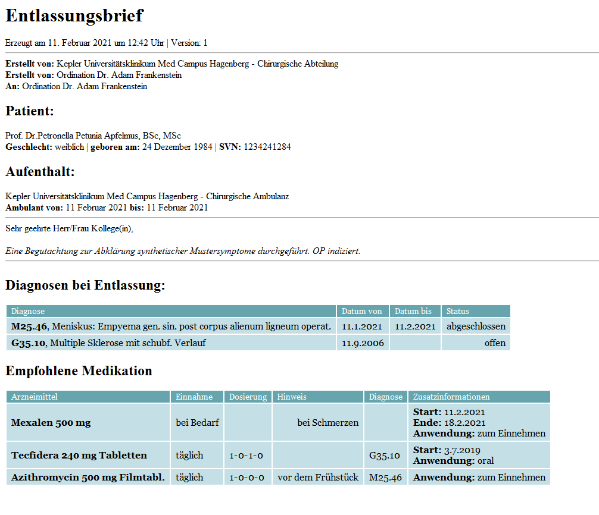
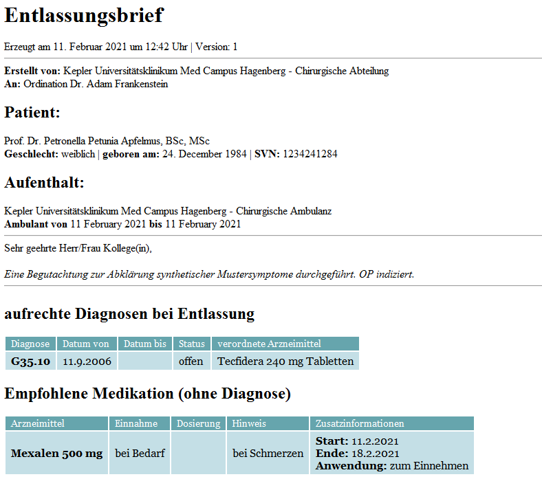

= Übung 04
:author: Florian Weingartshofer
:email: <S1910307103@students.fh-hagenberg.at>
:reproducible:
:listing-caption: Listing
:source-highlighter: rouge
:stem:

== a)

[source,xml]
----
include::./src/entlassbrief.xslt[]
----

<<<
    
== b)

[source,xml]
----
include::./src/entlassbrief_pull.xslt[]
----

